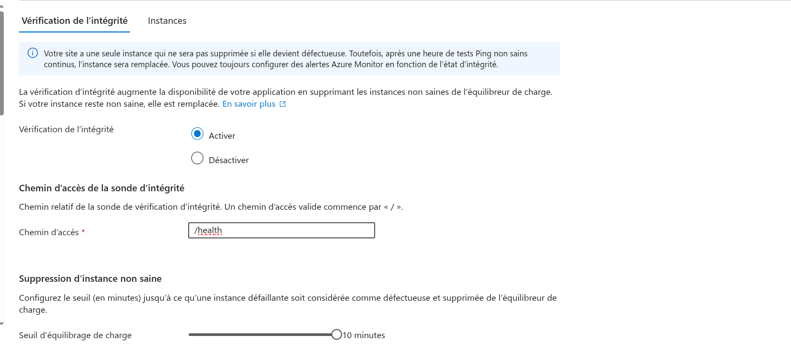
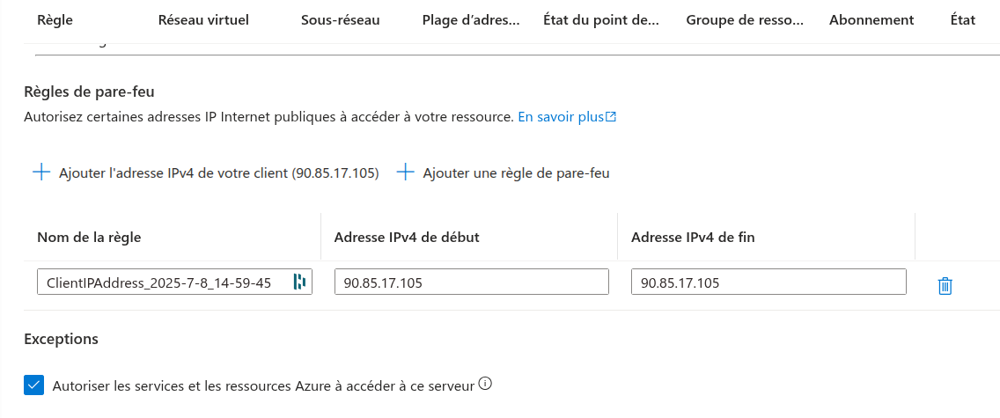
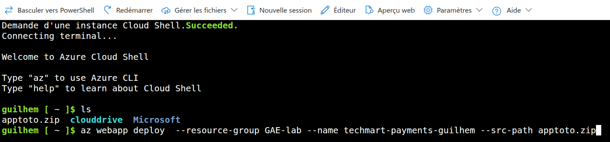
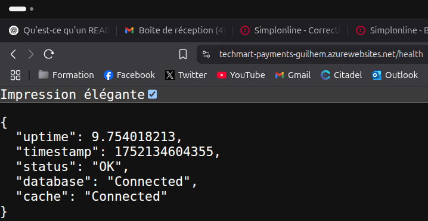

# Déploiement Azure Production avec Monitoring

## Objectif

Déployer une infrastructure Azure de production avec monitoring avancé, en tenant compte de la montée en charge et des contraintes budgétaires. Ce projet simule une mission DevOps réaliste, incluant supervision, sécurité et bonnes pratiques de déploiement.

## Réflexion stratégique

### 1. Quels sont les risques majeurs pour une API de paiement ?

- **Indisponibilité de l’API** : empêche les paiements et crée une perte directe de revenus.
- **Fuite de données sensibles** : ex. fuites d’informations clients ou de cartes, avec des conséquences légales et financières.
- **Temps de réponse trop long** : impacte l’expérience utilisateur et peut entraîner des abandons de panier.
- **Attaques par déni de service (DDoS)** : surcharge du service pouvant entraîner un crash.
- **Fraude ou transactions non sécurisées** : si les contrôles sont insuffisants (ex. manque d’authentification, pas de chiffrement).

### 2. Quelles métriques sont critiques à surveiller ?

| Catégorie               | Métrique                                 |
|-------------------------|------------------------------------------|
| **Performance**         | Temps de réponse moyen (`requests/duration`) |
| **Fiabilité**           | Taux d’erreurs (500, 502, timeout, etc.) |
| **Charge système**      | Nombre de requêtes par seconde           |
| **Disponibilité**       | Résultat des sondes `/health`            |
| **Business**            | Nombre de transactions réussies/échouées |
| **Sécurité**            | Tentatives de connexion échouées / pics d’activité suspects |

Ces métriques doivent être visualisables dans **Azure Monitor** et **Application Insights**, avec alertes configurées pour réagir en temps réel.

### 3. Comment structurer l'infrastructure pour minimiser les coûts ?

- **Utiliser les services PaaS** (App Service, Azure SQL, Redis) plutôt que du IaaS (VMs) pour éviter la maintenance et réduire les frais fixes.
- **Choisir des plans tarifaires adaptés** à la charge réelle (ex. S0 pour SQL, B1 pour App Service, Basic pour Redis).
- **Automatiser l’arrêt des environnements de test** ou de staging pendant les heures creuses.
- **Activer la mise en veille automatique** des ressources non sollicitées.
- **Surveiller les coûts avec Azure Cost Management** et créer des alertes budgétaires.
- **Limiter la redondance non critique** : éviter la haute disponibilité sur des services de test.

## Architecture (exemple à adapter)

```
[ Utilisateur ]
     |
[ App Service (Backend API) ]
     |
+----+------------------+---------------------+
|                         |                  
[ Azure SQL / PostgreSQL ]   [ Redis Cache ] 
     |
[ Application Insights ]
     |
[ Azure Monitor (Alertes) ]
```

## Choix techniques et justifications

### Pourquoi utiliser **Redis Cache** ?
| Cas d’usage                            | Redis ? |
|----------------------------------------|---------|
| Accélération des temps de réponse API  | Oui     |
| Sessions utilisateurs                  | Oui     |
| Faible trafic ou projet statique       | Non     |

## Commandes de déploiement Azure CLI

### Création du groupe de ressources
```bash
az group create --name GAE-lab --location "France Central"
```

### Création de la base de données
```bash
az sql server create \
  --name prodsql-$(whoami) \
  --resource-group GAE-lab \
  --location "France Central" \
  --admin-user adminbrief \
  --admin-password "DevOps@2024!"

az sql db create \
  --resource-group GAE-lab \
  --server prodsql-$(whoami) \
  --name prod-db \
  --service-objective S0
```
### Redis Cache
```bash
az redis create \
  --name techmart-cache-$(whoami) \
  --resource-group GAE-lab \
  --location "France Central" \
  --sku Basic \
  --vm-size c0
```

### App Service + déploiement de l'API
```bash
az appservice plan create \
  --name app-plan-prod \
  --resource-group GAE-lab \
  --sku S1 \
  --is-linux

az webapp create \
  --name prod-api-$(whoami) \
  --plan app-plan-prod \
  --resource-group GAE-lab \
  --runtime "NODE|20-lts"
```

## Monitoring et alertes

### Création Application Insights
```bash
az monitor app-insights component create \
  --app prod-insights \
  --location "France Central" \
  --resource-group GAE-lab \
  --application-type web
```

### Alerte sur erreur paiement
```bash
az monitor metrics alert create \
  --name "Prod Payment Errors" \
  --resource-group GAE-lab \
  --scopes /subscriptions/$(az account show --query id -o tsv)/resourceGroups/GAE-lab/providers/Microsoft.Insights/components/prod-insights \
  --condition "count exceptions/count > 5" \
  --description "Plus de 5 erreurs critiques en 5 min" \
  --evaluation-frequency 1m \
  --window-size 5m \
  --severity 0
```


## Tweak dans l'interface graphique

1. Vérification de l'intégrité


2. Dans la configuration de l'App, tout activer sauf :
Proxy d’affinité de session
HTTPS uniquement
Débogage distant

3. Server SQL puis Sécurité puis Mise en réseau :
Ajout de règle pour autoriser l'adresse IP
Cocher Autoriser les services et les ressources Azure à accéder à ce serveur
 

## Variables d'environnement

```bash
DB_USER
DB_PASSWORD
DB_NAME
DB_SERVER
REDIS_HOST
APPINSIGHTS_INSTRUMENTATIONKEY
```


## Base de données – Script SQL

```sql
CREATE TABLE Payments (
    PaymentId int IDENTITY(1,1) PRIMARY KEY,
    Amount decimal(10,2) NOT NULL,
    Currency nvarchar(3) NOT NULL,
    MerchantId nvarchar(50) NOT NULL,
    Status nvarchar(20) NOT NULL,
    CreatedAt datetime2 NOT NULL DEFAULT GETDATE()
);

CREATE INDEX IX_Payments_MerchantId_CreatedAt ON Payments(MerchantId, CreatedAt);
```

## Déploiement de l'application

### Préparation ZIP
```bash
npm install --production
zip -r app.zip index.js package.json .deployment
```

### Déploiement depuis Azure cloud shell
```bash
az webapp deploy `
  --resource-group GAE-lab `
  --name prod-api-$(whoami) `
  --src-path "C:\chemin\vers\app.zip"
```



## Nettoyage
```bash
az group delete --name GAE-lab --yes --no-wait
```

## Apports de ce projet

- Déploiement cloud complet avec supervision
- Gestion des coûts et montée en charge
- Sécurité et configuration réseau Azure
- Monitoring orienté métier via Application Insights

## Difficultés rencontrées

- Problèmes lors du déploiement du ZIP

## Réutilisation en production réelle

- Automatiser via un pipeline CI/CD
- Intégrer Azure Key Vault pour les secrets
